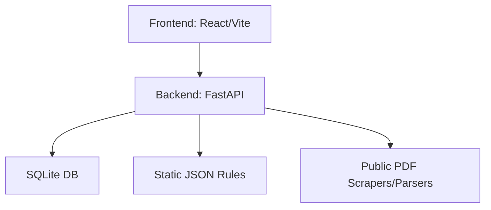

# 30-ARCHITECTURE.md: Technical Design

## 1. High-Level Architecture

## 2. Technology Stack
- **Frontend**: Vite + React + Tailwind + Lucide Icons + Framer Motion (for premium feel).
- **Backend**: FastAPI (Python 3.11+).
- **Database**: SQLite (Simple, file-based, local-first).
- **Deployment**:
    - Backend: Fly.io (supports SQLite persistence volumes).
    - Frontend: Vercel.

## 3. Data Flow
1. User enters product name/HSN.
2. Backend queries SQLite `hsn_data` table.
3. Backend applies rule-based logic from `compliance_rules.json`.
4. Response returns structured JSON to Frontend.

## 4. Key Components
- **Search Engine**: Uses SQLite `FTS5` for fast full-text searching across product descriptions.
- **Rule Engine**: A simple Python module that maps HSN prefixes (e.g., `09` for Spices) to specific certification requirements (e.g., "Spice Board Registration required").
- **Estimator**: Calculates Duty Drawback based on current FOB value.
